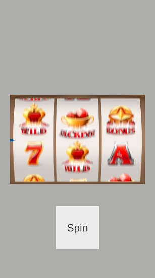
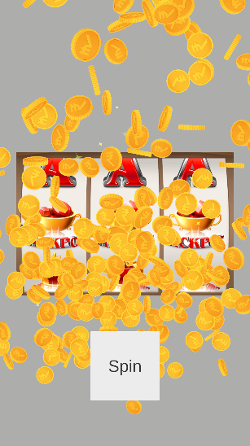

##A demo Slot Machine game project. 
Contains an implementation based on [BonLib](https://github.com/Bonfolit/BonLib)  
Utilizes knapsack probability solver for outcome predictions.  
Combines reactive programming methods with async controls.  
---

